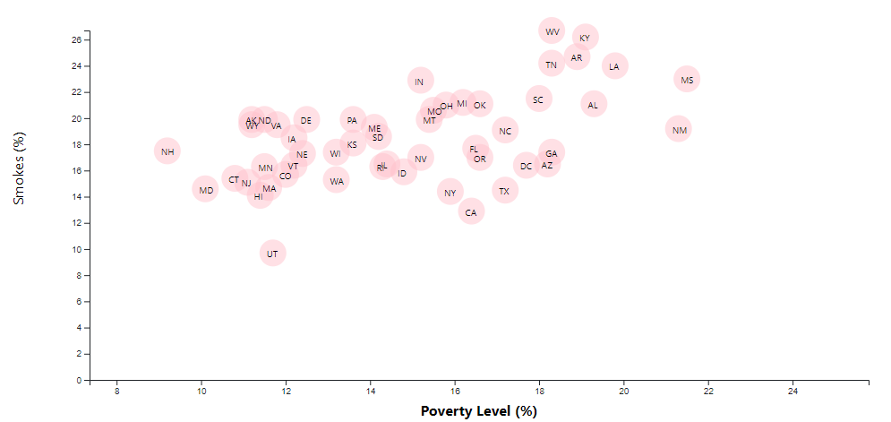

# D3-challenge
Using D3.js to investigate U.S. Census Bureau and the Behavioral Risk Factor Surveillance System datasets

# Background

This project centers around data visualization using D3.js, with the premise being working for a major newspaper. You are tasked with analyzing the current trends shaping people's lives, as well as creating charts, graphs, and interactive elements to illustrate findings. 

The data in question deals with demographics, as it was sourced through the U.S. Census Bureau and the Behavioral Risk Factor Surveillance System. The data, contained within the *data* folder, is the 2014 ACS 1-year estimates, and it includes indicators like income, obesity, and poverty by state. 

## Understanding the Repo
The `Starter Code` folder houses the necessary files required for the analysis, which are HTML, CSS, and Javascript. 
In pursuit of the bonus challenge, which includes axis groups on both axes that are interactive, another file, `bonus_workbook.js`, has been added with preliminary work.

# The Task

The required assignment involved creating a graph comparing two factors from the dataset using D3. The created example can be seen below.

This task required using the `d3.csv` function to pull the data from `data.csv`, and required state abbreviations to appear inside the circles. Also, because it is not default in D3, the axes and labels must be on the left and bottom.

Additionally, the command `python -m http.server` or use of the Live Server extension in VSCode was requried to run the visualization. 

# Bonus (impress the boss)

The optional extension assignement required making an interactive visualization through toggle-able axes. An example can be seen below:

## 1. More Data, More Dynamics
You're going to include more demographics and more risk factors. Place additional labels in your scatter plot and give them click events so that your users can decide which data to display. Animate the transitions for your circles' locations as well as the range of your axes. Do this for two risk factors for each axis. Or, for an extreme challenge, create three for each axis.

- Try binding the CSV data to the circles, which will easily let you determine their x or y values when you click the labels

## 2. Incorporate d3-tip
While the ticks on the axes allow us to infer approximate values for each circle, it's impossible to determine the true value without adding another layer of data. Enter tooltips: developers can implement these in their D3 graphics to reveal a specific element's data when the user hovers their cursor over the element. Add tooltips to your circles and display each tooltip with the data that the user has selected. The `d3-tip.js` plugin was developed by Justin Palmer. It can be seen in action below:

